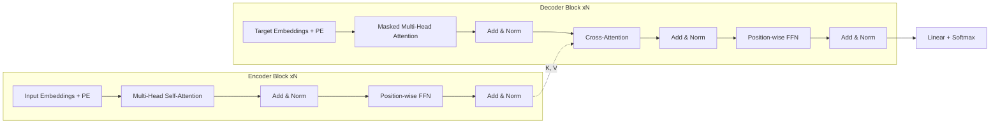
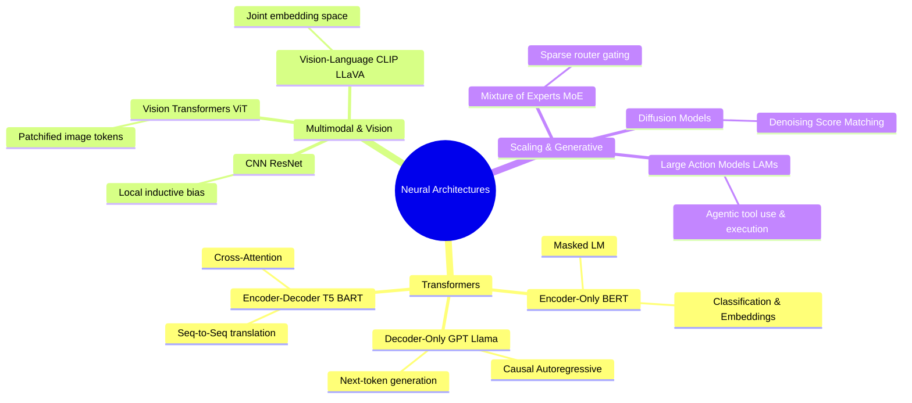

# Graduate Research Notes: Deep Learning & Modern Neural Architectures

**Course / Module:** CS8803 / Advanced Generative AI & Deep Learning Systems  
**Primary References:**
- Vaswani et al. (2017), *Attention Is All You Need* ([`introduction_and_life_cycle/attention is all you need.pdf`](introduction_and_life_cycle/attention%20is%20all%20you%20need.pdf))
- Research Compendium, *AI Model Architectures: A Technical Compendium* ([`introduction_and_life_cycle/AI Model Architectures Compendium.pdf`](introduction_and_life_cycle/AI%20Model%20Architectures%20Compendium.pdf))
- Core Syllabus, *Foundational Modules & Lifecycle* ([`introduction_and_life_cycle/intro.md`](introduction_and_life_cycle/intro.md))

---

## 1. Classical Sequence Modeling & The Recurrence Bottleneck

### 1.1 Recurrent Neural Networks (RNNs) & Limitations
Traditional sequence-to-sequence and sequence transduction paradigms modeled temporal dependencies via iterative recurrence:
$$h_t = f(W_{hh} h_{t-1} + W_{xh} x_t + b_h)$$
$$y_t = g(W_{hy} h_t + b_y)$$

#### Fundamental Limitations:
1. **Strict Sequential Execution Dependency ($\mathcal{O}(n)$ Sequential Steps):**
   - Hidden state computation at step $t$ strictly requires $h_{t-1}$.
   - Prevents intra-sequence parallelization across GPU/TPU streaming multiprocessors during training.
2. **Vanishing and Exploding Gradients (BPTT):**
   - Backpropagation Through Time requires computing Jacobian products:
     $$\frac{\partial h_T}{\partial h_t} = \prod_{j=t+1}^{T} \frac{\partial h_j}{\partial h_{j-1}}$$
   - Repeated matrix multiplications lead to exponential decay (vanishing) or exponential growth (exploding) of gradient signals.
3. **Information Compression Bottleneck:**
   - Sequential compression of an arbitrary-length context window into a fixed-size vector $h_t$ limits effective context retention.

---

## 2. Foundations: Optimization, FFNs, and Normalization

### 2.1 Position-wise Feedforward Networks (FFN)
Within modern sequence architectures, token-wise representation transformation is handled by identical two-layer Multi-Layer Perceptrons applied across positions:
$$\text{FFN}(x) = \sigma(x W_1 + b_1) W_2 + b_2$$
- $W_1 \in \mathbb{R}^{d_{\text{model}} \times d_{\text{ff}}}$, $W_2 \in \mathbb{R}^{d_{\text{ff}} \times d_{\text{model}}}$ (typically $d_{\text{ff}} = 4 \times d_{\text{model}}$).
- Non-linearities: $\text{ReLU}$, $\text{GELU}(x) = x \cdot \Phi(x)$, or $\text{SwiGLU}(x, W, V) = \text{Swish}(xW) \otimes (xV)$.

### 2.2 Residual Connections & Layer Normalization
To facilitate gradient propagation through deep stacks ($N \ge 6$ to hundreds of layers):
$$\text{Output} = \text{LayerNorm}(x + \text{Sublayer}(x)) \quad \text{[Post-LN]}$$
$$\text{Output} = x + \text{Sublayer}(\text{LayerNorm}(x)) \quad \text{[Pre-LN (Standard in modern LLMs)]}$$
$$\text{LayerNorm}(x) = \frac{x - \mu}{\sqrt{\sigma^2 + \epsilon}} \odot \gamma + \beta$$

---

## 3. The Transformer Architecture (Vaswani et al., 2017)

### 3.1 Scaled Dot-Product Attention
Attention operates as a differentiable, content-addressable memory lookup:
$$\text{Attention}(Q, K, V) = \text{softmax}\left(\frac{QK^T}{\sqrt{d_k}} + M\right)V$$
- **Matrices:** $Q \in \mathbb{R}^{N \times d_k}$ (Queries), $K \in \mathbb{R}^{M \times d_k}$ (Keys), $V \in \mathbb{R}^{M \times d_v}$ (Values).
- **Temperature Scaling ($\frac{1}{\sqrt{d_k}}$):** Prevents large dot products from saturating softmax gradients in high dimensions.
- **Attention Mask $M$:**
  - Standard Encoder: $M_{ij} = 0$.
  - Causal Decoder: $M_{ij} = -\infty$ for $j > i$ (prevents attending to future tokens).

### 3.2 Multi-Head Attention (MHA)
Enables simultaneous projection into $h$ distinct representation subspaces:
$$\text{MultiHead}(Q, K, V) = \text{Concat}(\text{head}_1, \dots, \text{head}_h)W^O$$
$$\text{head}_i = \text{Attention}(Q W_i^Q, K W_i^K, V W_i^V)$$
Where $W_i^Q \in \mathbb{R}^{d_{\text{model}} \times d_k}$, $W_i^K \in \mathbb{R}^{d_{\text{model}} \times d_k}$, $W_i^V \in \mathbb{R}^{d_{\text{model}} \times d_v}$, and $W^O \in \mathbb{R}^{h d_v \times d_{\text{model}}}$.

### 3.3 Positional Encodings
Because pure self-attention is invariant to permutation, spatial/order signals are injected:
$$PE_{(pos, 2i)} = \sin\left(\frac{pos}{10000^{2i / d_{\text{model}}}}\right), \quad PE_{(pos, 2i+1)} = \cos\left(\frac{pos}{10000^{2i / d_{\text{model}}}}\right)$$
*(Note: Modern architectures frequently utilize RoPE — Rotary Position Embeddings or ALiBi).*

---

## 4. Modern AI Architectural Taxonomies

### 4.1 Comparative Taxonomy Matrix

| Architecture Family | Typical Models | Core Attention / Structural Mechanism | Pre-training Objective | Optimal Applications |
| :--- | :--- | :--- | :--- | :--- |
| **Encoder-Only** | BERT, RoBERTa, DeBERTa | Bidirectional Self-Attention (all-to-all token visibility) | Masked Language Modeling (MLM), Next Sentence Prediction | Extractive QA, Sentiment classification, NER, Dense retrieval embeddings |
| **Decoder-Only** | GPT-3/4, Llama 2/3, Mistral | Causal Masked Attention (left-to-right only) | Autoregressive Next-Token Prediction ($\max_\theta \sum \log P(x_t \mid x_{<t})$) | Free-form dialogue, Text generation, In-context few-shot reasoning, Code synthesis |
| **Encoder-Decoder** | T5, BART, Original Vaswani | Encoder self-attention + Decoder causal & cross-attention | Denoising span corruption, Sequence transduction | Abstractive summarization, Multi-lingual translation, Structured data-to-text |
| **Vision Transformers (ViT)** | ViT-B/16, Swin | Image broken into $16 \times 16$ non-overlapping patches + Linear projection | Supervised / Self-Supervised (MAE) | Large-scale image classification, Global visual scene understanding |
| **Vision-Language (VLM)** | CLIP, LLaVA, Flamingo | Cross-modal projection layers connecting Visual Encoder to LLM | InfoNCE Contrastive Loss / Cross-entropy generation | Visual Question Answering (VQA), Diagram analysis, Zero-shot classification |
| **Mixture of Experts (MoE)** | Mixtral 8x7B, Switch Transformer, GPT-4 | Gating/Router network routing token $x$ to top-$k$ of $N$ feedforward networks | Standard causal LM with load balancing loss | High-capacity model scaling with constant per-token inference FLOPs |
| **Diffusion & Flow Matching** | DDPM, Stable Diffusion, SDXL, Flux | U-Net / DiT (Diffusion Transformer) with Cross-Attention conditioning | Reverse Gaussian diffusion denoising score matching | High-fidelity text-to-image/video synthesis |
| **Large Action Models (LAMs)** | Web/OS Agents, Act-1 | ReAct loops, tokenized API/OS action space, iterative environment state feedback | Trajectory imitation learning + RL with environment reward | Web browsing automation, Multi-turn API tool use, Desktop agents |

---

## 5. Algorithmic & Computational Complexity Analysis

| Architecture Layer | Computational Complexity per Layer | Sequential Operations Metric | Maximum Path Length | Memory Footprint (KV Cache) |
| :--- | :--- | :--- | :--- | :--- |
| **Standard Self-Attention** | $\mathcal{O}(n^2 \cdot d)$ | $\mathcal{O}(1)$ | $\mathcal{O}(1)$ | $\mathcal{O}(b \cdot l \cdot n \cdot d)$ |
| **Recurrent Layer (LSTM/GRU)** | $\mathcal{O}(n \cdot d^2)$ | $\mathcal{O}(n)$ | $\mathcal{O}(n)$ | $\mathcal{O}(b \cdot d)$ |
| **Convolutional Layer (1D)** | $\mathcal{O}(k \cdot n \cdot d^2)$ | $\mathcal{O}(1)$ | $\mathcal{O}(\log_k(n))$ | N/A |

- **Notation:** $n =$ sequence length, $d =$ hidden dimension, $k =$ kernel size, $b =$ batch size, $l =$ number of layers.
- **Key Takeaway:** While self-attention achieves an optimal $\mathcal{O}(1)$ maximum path length (direct interaction between any token pair in one step), it incurs a quadratic $\mathcal{O}(n^2)$ computational and memory cost with respect to context length $n$, motivating linear attention, FlashAttention, and FlashDecoding optimizations in practice.

---

## 6. Research Synthesis & Key Takeaways

1. **Decoupling Dependency Distance:** In recurrent networks, long-term credit assignment diminishes over temporal paths of length $\mathcal{O}(n)$. Transformers achieve $\mathcal{O}(1)$ path length, enabling robust long-range context preservation.
2. **Computational Parallelism as an Enabler:** Replacing recurrence with position-wise operations and matrix dot products mapped sequence modeling directly onto GPU tensor core hardware capabilities.
3. **Scaling Law Convergence:** The combination of attention mechanisms, residual normalization paths, and self-supervised objectives paved the way for compute-optimal scaling laws ($N, D \propto C$), unifying NLP, Computer Vision, Multimodal, and Autonomous Agent systems.
